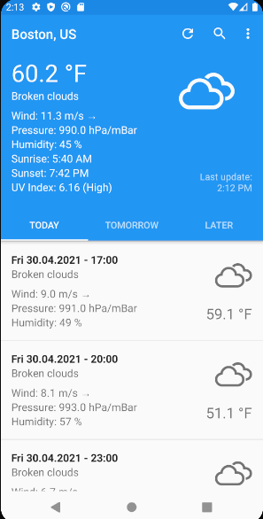

# Forecastie

Una semplice app meteo per Android, basata su software libero. Ottiene i dati da [OpenWeatherMap](https://openweathermap.org/), attraverso la sua API pubblica.

## Caratteristiche
* Design semplice
* Previsioni meteo dettagliate (5 giorni)
* Unità di misura multiple
* Funziona con qualsiasi città nel mondo
* Funzionamento senza connessione

## Schermate

## Demo

## Contributi
Se hai un'idea o un problema, non esitare a contattarci attraverso la pagina dei bachi. Ogni contributo è benvenuto. Vedere [Contributi](https://github.com/martykan/forecastie/blob/master/CONTRIBUTING.md) per maggiori informazioni.

Prego notare che il progetto è rilasciato attraverso un Codice di Condotta per i Contribuenti. Partecipando al progetto, accetti di sottostare ai suoi termini.

## Licenza
  

Questa applicazione è Software Libero: puoi usarlo, studiarlo, condividerlo e migliorarlo secondo i termini della [Licenza Pubblica Generale GNU](https://www.gnu.org/licenses/gpl.html) come pubblicata dalla Fondazione per il Software Libero, versione 3 della Licenza o, a Tua scelta, una versione successiva.

I dati meteo sono forniti da [OpenWeatherMap](https://openweathermap.org/), secondo la <a href='http://creativecommons.org/licenses/by-sa/2.0/'>licenza Creative Commons</a>.

Le Icone sono <a href='https://erikflowers.github.io/weather-icons/'>Weather Icons</a>, di <a href='http://www.twitter.com/artill'>Lukas Bischoff</a> e <a href='http://www.twitter.com/Erik_UX'>Erik Flowers</a>, secondo la licenza <a href='http://scripts.sil.org/OFL'>SIL OFL 1.1</a>.
